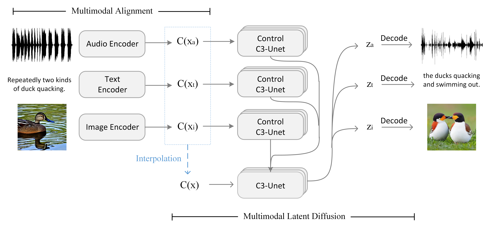
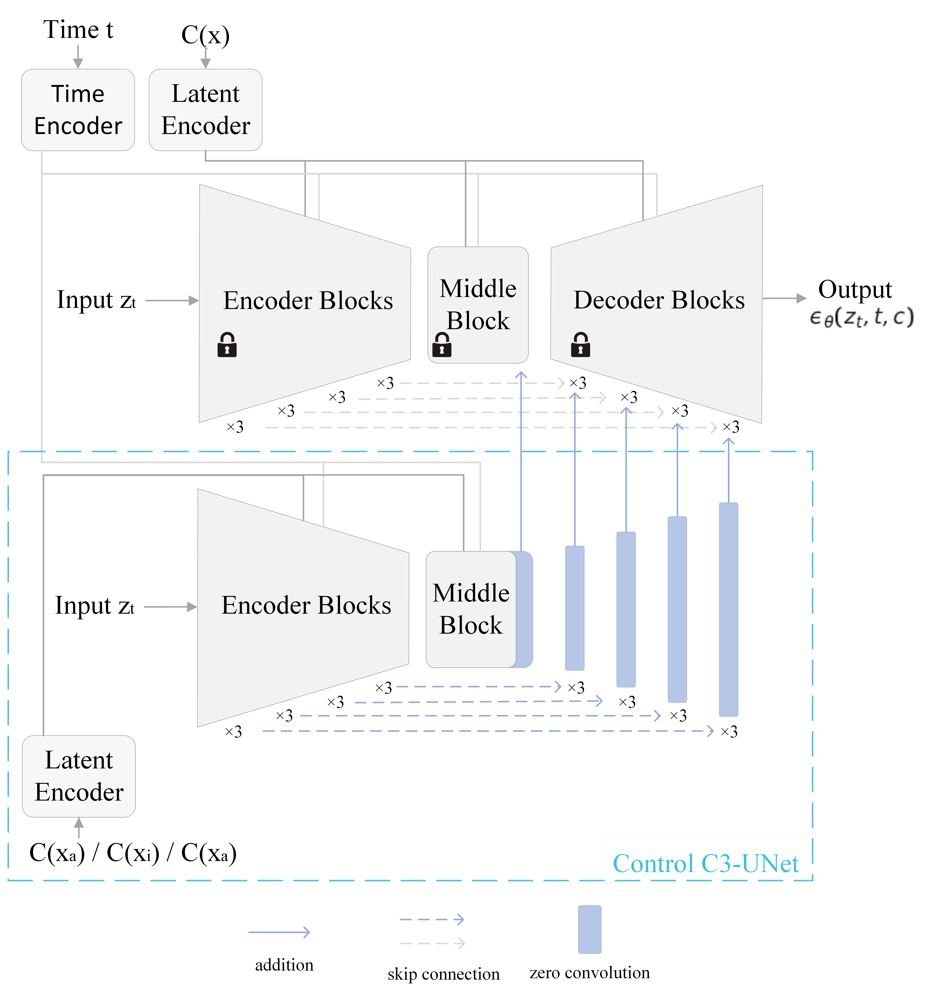

<h2 align="center">C3Net: Compound Conditioned ControlNet for Multimodal Content Generation</h2>
<div align="center">
  <span class="author-block">
    Juntao Zhang<sup>1</sup>,</span>
  <span class="author-block">
    Yuehuai Liu<sup>1</sup>,</span>
  <span class="author-block">
    Yu-Wing Tai<sup>2</sup>,</span>
  <span class="author-block">
    Chi-Keung Tang<sup>1</sup>,</span>
</div>
<div align="center">
  <span class="author-block"><sup>1</sup>HKUST,</span>
  <span class="author-block"><sup>2</sup>Dartmouth College</span>
</div>

[](https://arxiv.org/abs/2311.17951)  

## Abstruct

<p align="center">
  
</p>
We present Compound Conditioned ControlNet, C3Net, a novel generative neural architecture taking conditions from multiple modalities and synthesizing multimodal contents simultaneously (e.g., image, text, audio). C3Net adapts the ControlNet architecture to jointly train and make inferences on a production-ready diffusion model and its trainable copies. Specifically, C3Net first aligns the conditions from multi-modalities to the same semantic latent space using modality-specific encoders based on contrastive training. Then, it generates multimodal outputs based on the aligned latent space, whose semantic information is combined using a ControlNet-like architecture called Control C3-UNet. Correspondingly, with this system design, our model offers an improved solution for joint-modality generation through learning and explaining multimodal conditions instead of simply taking linear interpolations on the latent space. Meanwhile, as we align conditions to a unified latent space, C3Net only requires one trainable Control C3-UNet to work on multimodal semantic information. Furthermore, our model employs unimodal pretraining on the condition alignment stage, outperforming the non-pretrained alignment even on relatively scarce training data and thus demonstrating high-quality compound condition generation. We contribute the first high-quality tri-modal validation set to validate quantitatively that C3Net outperforms or is on par with first and contemporary state-of-the-art multimodal generation. Our codes and tri-modal dataset will be released.

## Pipline
<p align="center">
  
</p>

### Details

<p align="center">
  
</p>

## Compound Multimodal Conditioned Synthesis 
<p align="center">
  
</p>

<p align="center">
  
</p>

## Acknowledgements

We would like to thank the contributors to the [CoDi](https://github.com/microsoft/i-Code/tree/main) and [SSAST](https://github.com/YuanGongND/ssast) repositories, for their open research and exploration.

## Citation

```
@INPROCEEDINGS{C3Net2024,
      title={C3Net: Compound Conditioned ControlNet for Multimodal Content Generation}, 
      author={Juntao Zhang and Yuehuai Liu and Yu-Wing Tai and Chi-Keung Tang},
      booktitle={IEEE/CVF Conference on Computer Vision and Pattern Recognition (CVPR)},
      year={2024}
}


